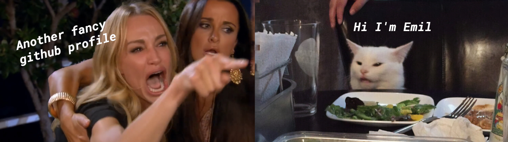

Hey there 👋

I’m Emil, a passionate and creative front-end developer that wants to spread his passion between the others. I make it my mission to translate user-focused designs into pixel-perfect websites or applications that run blazing fast 🚀

Want to know more about me? Fell free to ask me! 🤙 😎

 

## 📌 Highlighted Repositories

 

 

 

## 📈 GitHub Stats

 

  
 

## 💼 Skills

